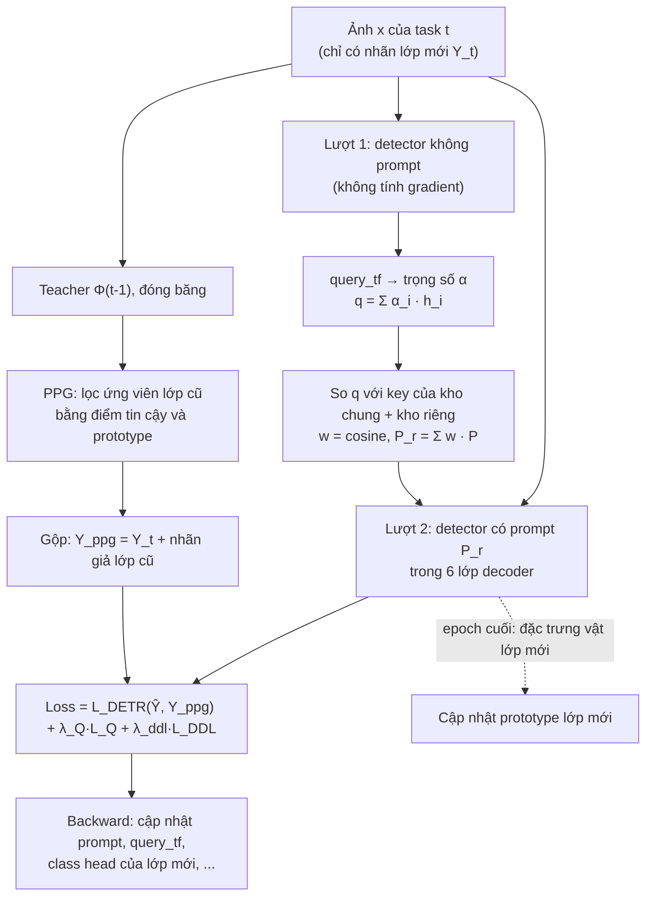
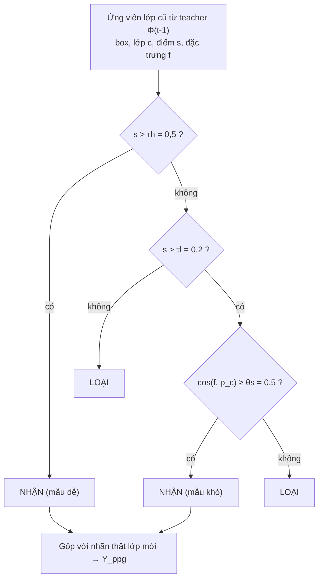

# Hiểu paper PDP từ con số 0

**Paper:** *Beyond Prompt Degradation: Prototype-guided Dual-pool Prompting for Incremental Object Detection*, Yaoteng Zhang, Qing Zhou, Junyu Gao, Qi Wang. CVPR 2026. File PDF nằm ở thư mục gốc của repo.
**Code gốc:** [github.com/zyt95579/PDP_IOD](https://github.com/zyt95579/PDP_IOD), commit `7702d91`. Mọi đường dẫn "Code" trong tài liệu này trỏ tới đúng commit đó. Bản đã sửa lỗi của nhóm nằm trong [`pdp/`](../../pdp).

**Dành cho ai:** người chưa có nhiều kinh nghiệm AI, cần hiểu paper đủ sâu để code, chạy thí nghiệm và bảo vệ đồ án.

**Cách đọc:**

- Chỉ có 5 phút: đọc [phần 0](#0-tóm-tắt-trong-5-phút).
- Chưa quen deep learning: đọc lần lượt phần 1 (kiến thức nền), rồi tới phần 2–7.
- Đã biết DETR và continual learning: đọc thẳng từ [phần 3](#3-hai-căn-bệnh-paper-chỉ-ra-prompt-coupling-và-prompt-drift).
- Cần tra một thuật ngữ: xem [phần 12](#12-bảng-thuật-ngữ).

**Quy ước:**

- Khối **"Code:"** cho biết khái niệm đang nói nằm ở đâu trong code gốc.
- Khối **"Lưu ý:"** đánh dấu chỗ code gốc khác paper. Các chỗ này đã được kiểm chứng bằng cách chạy code; bản sửa được mô tả trong [IMPLEMENTATION_PLAN.md §6.3](../archive/IMPLEMENTATION_PLAN_2026-09.md) (mã F1–F13).
- Ví dụ số có ghi "số tự đặt" là ví dụ minh họa, không lấy từ paper.
- Sơ đồ vẽ bằng Mermaid hiển thị được trên GitHub. Trong VS Code, cần cài extension *Markdown Preview Mermaid Support*. Các sơ đồ quan trọng nhất được vẽ bằng ký tự nên xem được ở mọi nơi.

## Mục lục

0. [Tóm tắt trong 5 phút](#0-tóm-tắt-trong-5-phút)
1. [Kiến thức nền](#1-kiến-thức-nền)
2. [MD-DETR: nền móng mà PDP xây lên](#2-md-detr-nền-móng-mà-pdp-xây-lên)
3. [Hai "căn bệnh" paper chỉ ra: prompt coupling và prompt drift](#3-hai-căn-bệnh-paper-chỉ-ra-prompt-coupling-và-prompt-drift)
4. [Kiến trúc tổng thể của PDP](#4-kiến-trúc-tổng-thể-của-pdp)
5. [DDP: hai kho prompt tách biệt](#5-ddp-hai-kho-prompt-tách-biệt)
6. [PPG: sinh nhãn giả nhờ prototype](#6-ppg-sinh-nhãn-giả-nhờ-prototype)
7. [Ghép lại: loss, siêu tham số, phần nào được train](#7-ghép-lại-loss-siêu-tham-số-phần-nào-được-train)
8. [Lúc dùng thật (suy luận)](#8-lúc-dùng-thật-suy-luận)
9. [Thí nghiệm: cách đọc các bảng kết quả](#9-thí-nghiệm-cách-đọc-các-bảng-kết-quả)
10. [Đối chiếu paper và code](#10-đối-chiếu-paper-và-code)
11. [Liên hệ với đồ án RPC](#11-liên-hệ-với-đồ-án-rpc)
12. [Bảng thuật ngữ](#12-bảng-thuật-ngữ)
13. [Câu hỏi tự kiểm tra](#13-câu-hỏi-tự-kiểm-tra)
14. [Bảng tóm tắt 13 công thức](#14-bảng-tóm-tắt-13-công-thức)

---

## 0. Tóm tắt trong 5 phút

**Bài toán (Incremental Object Detection, IOD).** Một mô hình phát hiện vật thể (detector) phải học thêm các lớp vật mới theo từng đợt. Mỗi đợt gọi là một **task**. Có ba ràng buộc:

- Khi học đợt mới, **không được dùng lại dữ liệu các đợt cũ**.
- Trong ảnh của đợt mới, **chỉ vật của lớp mới được gán nhãn**; vật của lớp cũ vẫn xuất hiện nhưng không có nhãn.
- Sau mỗi đợt, mô hình phải nhận ra **mọi lớp đã học**, không được quên lớp cũ.

**Hướng tiếp cận "prompt".** Giữ nguyên (đóng băng) một detector lớn đã được huấn luyện sẵn. Mỗi đợt chỉ học thêm một ít vector nhỏ gọi là **prompt**, rồi "nhét" các vector này vào bên trong detector để điều chỉnh cách nó nhìn ảnh. Vì phần lớn mô hình không đổi nên ít bị quên, và không cần lưu ảnh cũ.

**Paper chỉ ra hai "căn bệnh" của các phương pháp prompt trước đó** (gọi chung là *prompt degradation*, prompt bị thoái hóa):

1. **Prompt coupling (prompt bị trộn lẫn).** Kiến thức dùng chung cho mọi đợt (ví dụ: vật có cạnh, có bóng, có nhãn in) và kiến thức riêng của từng lớp (lon Coca khác lon Pepsi) nằm chung một kho, nên chúng tranh chỗ và giẫm chân nhau.
2. **Prompt drift (prompt bị trôi).** Vật lớp cũ trong ảnh mới không có nhãn, nên mô hình bị dạy rằng "chỗ đó là nền". Các prompt đã học cho lớp cũ bị kéo lệch dần.

**Thuốc chữa của PDP:**

| Căn bệnh | Thuốc | Ý tưởng một câu |
|---|---|---|
| Prompt coupling | **DDP** (Decoupled Dual-Pool Prompting) | Hai kho prompt: **kho chung** (luôn được học tiếp, chứa kiến thức chung) và **kho riêng** (mỗi lớp một prompt, học xong thì khóa). Thêm một loss **L_DDL** ép hai kho "nhìn về hai hướng khác nhau". |
| Prompt drift | **PPG** (Prototypical Pseudo-Label Generation) | Dùng mô hình của đợt trước (teacher) đoán nhãn cho vật lớp cũ. Nhận ngay nếu teacher rất chắc; nếu teacher chỉ chắc vừa phải thì so đặc trưng của vật với **prototype** (vector trung bình) của lớp đó, giống thì nhận. |

**Kết quả paper báo cáo:** trên MS-COCO chia 4 task, điểm tổng mAP@A sau task cuối là **59,4**, cao hơn MD-DETR (50,2) **9,2 điểm**. Trên PASCAL VOC, mAP@A là 78,7 / 78,0 / 79,4 cho ba kịch bản 10+10, 15+5, 19+1.

**Một hình ảnh so sánh.** Hình dung một nhân viên thu ngân đã được đào tạo nhìn hàng hóa nói chung (detector đóng băng). Mỗi đợt nhập hàng mới, họ nhận thêm một cuốn sổ tay:

- **Sổ tay chung** (kho chung): mẹo nhìn hàng dùng cho mọi đợt. Đợt nào cũng được viết thêm, sửa thêm.
- **Trang riêng cho từng món hàng** (kho riêng): viết khi món đó mới về, rồi dán kín lại để không ai sửa nhầm.
- **Hỏi "mình của hôm qua"** (PPG): ảnh luyện tập của đợt mới có lẫn hàng cũ chưa được dán nhãn. Nhân viên hỏi lại phiên bản mình trước đợt này: "món này là gì?". Nếu câu trả lời rất chắc thì tin. Nếu câu trả lời lưỡng lự thì so món đó với "ảnh mẫu trung bình" của món hàng được nêu tên; giống thì mới tin.

---

## 1. Kiến thức nền

Phần này chỉ giải thích những gì cần để hiểu paper. Có thể bỏ qua mục nào bạn đã biết.

### 1.1 Phát hiện vật thể (object detection)

Đầu vào là một ảnh. Đầu ra là một danh sách, mỗi phần tử gồm:

- **box** (hộp bao): hình chữ nhật bao quanh vật. Code dùng dạng `(cx, cy, w, h)`: tọa độ tâm, chiều rộng, chiều cao, tất cả chia cho kích thước ảnh nên nằm trong [0, 1].
- **class** (lớp): vật đó là gì, ví dụ "lon Coca 330 ml".
- **score** (điểm tin cậy): mô hình chắc chắn bao nhiêu, từ 0 đến 1.

**IoU (Intersection over Union)** đo hai box trùng nhau bao nhiêu:

$$
\text{IoU}(A, B) = \frac{\text{area}(A \cap B)}{\text{area}(A \cup B)}
$$

Tử số là diện tích phần giao của hai box, mẫu số là diện tích phần hợp.

Ví dụ (số tự đặt): box A từ (0, 0) tới (100, 100), box B từ (50, 0) tới (150, 100). Phần giao rộng 50, cao 100, diện tích 5.000. Phần hợp là 10.000 + 10.000 − 5.000 = 15.000. IoU = 5.000 / 15.000 ≈ 0,33. Một dự đoán thường được tính là "trúng" nếu đúng lớp và IoU với box thật ≥ 0,5.

### 1.2 Mạng nơ-ron học như thế nào

- **Tham số (weights):** các con số bên trong mô hình. Mô hình PDP có khoảng 66 triệu tham số.
- **Loss (hàm mất mát):** một con số đo mô hình đang sai bao nhiêu so với nhãn thật. Càng nhỏ càng tốt.
- **Gradient:** cho biết nên chỉnh mỗi tham số theo hướng nào để loss giảm. Tính bằng **lan truyền ngược** (backpropagation).
- **Optimizer (bộ tối ưu, ở đây là AdamW):** dùng gradient để cập nhật tham số, mỗi lần một bước nhỏ. Độ lớn bước gọi là **learning rate** (lr).
- **Batch:** số ảnh xử lý cùng lúc trong một bước. **Epoch:** một lượt đi qua toàn bộ dữ liệu train.
- **Đóng băng (freeze):** không cập nhật một phần tham số. Phần đó giữ nguyên giá trị suốt quá trình train. Trong code, tham số bị đóng băng có `requires_grad = False`.
- **Pretrained và fine-tune:** *pretrained* là mô hình đã được train sẵn trên một bộ dữ liệu lớn (ở đây là COCO). *Fine-tune* là train tiếp mô hình đó trên dữ liệu của mình.
- **`torch.no_grad()`:** đoạn code chạy trong khối này không tính gradient, nên cũng không học được gì từ nó.

### 1.3 Vector đặc trưng và độ tương đồng cosine

Bên trong mô hình, mỗi vật được biểu diễn bằng một **vector đặc trưng** (feature, embedding): một dãy số, ở PDP là 256 số. Hai vật giống nhau thì vector của chúng "chỉ về cùng một hướng".

**Độ tương đồng cosine** đo hai vector cùng hướng tới đâu, không quan tâm độ dài:

$$
\cos(\mathbf{a}, \mathbf{b}) = \frac{\mathbf{a} \cdot \mathbf{b}}{\lVert \mathbf{a} \rVert \, \lVert \mathbf{b} \rVert}
$$

- $\mathbf{a} \cdot \mathbf{b}$ là tích vô hướng: nhân từng cặp số rồi cộng lại.
- $\lVert \mathbf{a} \rVert$ là độ dài vector.
- Kết quả nằm trong [−1, 1]: 1 là cùng hướng, 0 là vuông góc (không liên quan), −1 là ngược hướng.
- Góc giữa hai vector là $\theta = \arccos(\cos)$: cos = 1 ứng với 0°, cos = 0 ứng với 90°.

Ví dụ (số tự đặt), vector 2 chiều:

| Cặp vector | Tích vô hướng | Độ dài | cos | Góc |
|---|---|---|---|---|
| a = (3, 4), b = (4, 3) | 12 + 12 = 24 | 5 và 5 | 24/25 = 0,96 | ≈ 16° |
| a = (3, 4), c = (−4, 3) | −12 + 12 = 0 | 5 và 5 | 0 | 90° |

PDP dùng cosine ở hai chỗ: chọn prompt (phần 5.3) và so vật với prototype (phần 6.2).

### 1.4 Attention: cơ chế "hỏi và tra cứu"

Transformer là loại mạng dựa trên **attention**. Có thể hình dung như tra cứu trong thư viện:

- **Query (Q):** câu hỏi của bạn.
- **Key (K):** nhãn trên gáy từng cuốn sách.
- **Value (V):** nội dung cuốn sách.

Mỗi query so với mọi key để biết nên đọc cuốn nào nhiều. Kết quả là trung bình có trọng số của các value:

$$
\text{Attention}(Q, K, V) = \text{softmax}\!\left(\frac{Q K^\top}{\sqrt{d_k}}\right) V
$$

- $QK^\top$: điểm khớp giữa từng query và từng key.
- Chia cho $\sqrt{d_k}$ ($d_k$ là số chiều của key) để các điểm không quá lớn.
- **softmax** biến các điểm thành trọng số dương, cộng lại bằng 1.
- **Self-attention:** Q, K, V lấy từ cùng một tập (ví dụ các object query "nói chuyện" với nhau). **Cross-attention:** Q từ một tập, K và V từ tập khác (ví dụ object query nhìn vào ảnh).
- **Multi-head:** chạy nhiều attention song song (ở đây 8 "head"), mỗi head nhìn một khía cạnh.

**PDP chèn prompt vào đúng công thức này** (phần 5.4): thêm vài key và value "nhân tạo" vào đầu danh sách.

### 1.5 DETR và Deformable DETR: detector mà PDP dùng

PDP dựa trên **Deformable DETR** (bản của HuggingFace, trọng số `SenseTime/deformable-detr` đã train trên COCO). Cấu trúc (các số lấy từ cấu hình mặc định trong code):

```
Ảnh (3 x H x W)
  |
  v
[Backbone ResNet-50]        trích đặc trưng ở nhiều độ phân giải (4 mức)
  |
  v  input_proj: đưa mọi mức về 256 kênh
[Encoder, 6 lớp]            mỗi vị trí trên ảnh "nhìn" vài điểm xung quanh (deformable attention)
  |
  v  "bộ nhớ ảnh" (memory)
[Decoder, 6 lớp, 300 object query]
    mỗi lớp decoder gồm 3 bước:
      1. self-attention giữa 300 query       <== PDP CHÈN PROMPT VÀO ĐÂY
      2. cross-attention (deformable): mỗi query nhìn vào ảnh
      3. FFN (mạng 2 lớp đơn giản)
  |
  v  300 vector, mỗi vector 256 số
  +--> Class head (Linear 256 -> K lớp): điểm của từng lớp, qua hàm sigmoid
  +--> Box head (MLP 3 lớp -> 4 số): cx, cy, w, h
```

**Object query là gì?** Hình dung 300 "người đi tìm vật". Mỗi người rà ảnh rồi báo cáo "tôi thấy vật lớp X ở box Y" hoặc "tôi không thấy gì". Vì vậy một ảnh luôn cho ra đúng 300 dự đoán; phần lớn trong số đó là "không có vật" (điểm của mọi lớp đều thấp).

**Deformable** nghĩa là mỗi query chỉ nhìn một số ít điểm quanh vị trí nó quan tâm (mặc định 4 điểm cho mỗi head ở mỗi mức), thay vì nhìn toàn bộ ảnh. Nhờ vậy nhanh và hội tụ nhanh hơn DETR gốc.

**Hungarian matching (ghép cặp một-một).** Khi train, có 300 dự đoán nhưng chỉ vài vật thật (ground truth, GT). Cần quyết định dự đoán nào chịu trách nhiệm cho vật nào. Thuật toán Hungarian tìm cách ghép **một-một** có tổng "chi phí" nhỏ nhất. Chi phí của một cặp gộp ba thành phần: sai lớp, sai vị trí box (L1) và độ lệch GIoU. Trong code, trọng số lần lượt là 1, 5 và 2.

Ví dụ (số tự đặt): 3 query, 2 vật thật. Bảng chi phí:

| | GT 1: lon Coca | GT 2: gói snack |
|---|---|---|
| query 1 | **0,2** | 0,9 |
| query 2 | 0,7 | **0,3** |
| query 3 | 0,8 | 0,8 |

Cách ghép tốt nhất: query 1 với Coca, query 2 với snack (tổng 0,5). Query 3 không được ghép, nên bị dạy là "không có vật".

**Loss của DETR** (công thức 4 trong paper) chỉ tính trên các cặp đã ghép:

$$
\mathcal{L}_{DETR} = \sum_i \Big[ \mathcal{L}_{cls}\big(c_i, \hat{s}_{\hat\sigma(i)}\big) + \mathbf{1}_{\{c_i \neq \varnothing\}} \cdot \mathcal{L}_{box}\big(b_i, \hat{b}_{\hat\sigma(i)}\big) \Big]
$$

- $c_i, b_i$: lớp và box của vật thật thứ $i$. $\hat{s}, \hat{b}$: điểm lớp và box dự đoán.
- $\hat\sigma(i)$: query được ghép với vật $i$ (kết quả Hungarian, công thức 3).
- $\mathcal{L}_{cls}$: loss phân loại. Deformable DETR dùng **focal loss**, một biến thể của cross-entropy giảm trọng số các mẫu dễ, để mô hình tập trung vào mẫu khó. Code dùng $\alpha = 0{,}25$, $\gamma = 2$.
- $\mathbf{1}_{\{c_i \neq \varnothing\}}$: bằng 1 nếu đó là vật thật, 0 nếu là "không có vật". Chỉ vật thật mới bị tính loss box.
- $\mathcal{L}_{box}$: trong code là $5 \cdot L_1 + 2 \cdot (1 - \text{GIoU})$. GIoU là biến thể của IoU vẫn cho tín hiệu học khi hai box không chạm nhau.

> **Code:** bộ ghép Hungarian ở [modeling_deformable_detr.py#L2372-L2450](https://github.com/zyt95579/PDP_IOD/blob/7702d91d595e5ceed5df333d50c68444d7075ef9/models/modeling_deformable_detr.py#L2372-L2450); focal loss ở [#L2187-L2225](https://github.com/zyt95579/PDP_IOD/blob/7702d91d595e5ceed5df333d50c68444d7075ef9/models/modeling_deformable_detr.py#L2187-L2225); trọng số các loss ở [#L2067](https://github.com/zyt95579/PDP_IOD/blob/7702d91d595e5ceed5df333d50c68444d7075ef9/models/modeling_deformable_detr.py#L2067). Cấu hình mặc định không bật loss phụ ở các lớp decoder trung gian (`auxiliary_loss=False`).

### 1.6 Continual learning và Incremental Object Detection

**Continual learning (học liên tục):** mô hình học một chuỗi task nối tiếp nhau. **Catastrophic forgetting (quên thảm khốc):** khi train tiếp trên dữ liệu mới, các tham số bị kéo về phía task mới, nên mô hình quên nhanh những gì học trước đó.

**Stability–plasticity (ổn định và dẻo dai):** mô hình cần **ổn định** để giữ kiến thức cũ, nhưng cũng cần **dẻo** để học cái mới. Hai mục tiêu này kéo ngược nhau. Paper đo hai mặt này bằng mAP@P (lớp cũ) và mAP@C (lớp mới), xem [phần 9.1](#91-các-chỉ-số-đo).

**Các hướng chống quên thường gặp:**

| Hướng | Ý tưởng | Nhược điểm |
|---|---|---|
| Replay (phát lại) | Giữ lại một ít ảnh cũ để train kèm | Tốn bộ nhớ; có khi không được giữ vì quyền riêng tư hoặc chi phí |
| Mở rộng mô hình | Mỗi task thêm một nhánh mạng mới | Mô hình phình to không kiểm soát |
| Regularization / distillation | Phạt khi mô hình mới khác mô hình cũ quá nhiều | Khó cân bằng |
| **Prompt** | Đóng băng mô hình, mỗi task chỉ học thêm vài vector nhỏ | Là hướng của PDP; paper chỉ ra nó vẫn bị "thoái hóa" |

**Quy trình IOD (phần 3 của paper):**

```
Tập lớp C = {C1, C2, ..., Cn}, các nhóm không trùng nhau.

Task 1: dữ liệu D1, chỉ gán nhãn lớp trong C1
Task 2: dữ liệu D2, chỉ gán nhãn lớp trong C2          (không được xem lại D1)
...
Task t: dữ liệu Dt, chỉ gán nhãn lớp trong Ct          (không được xem lại D1..D(t-1))
Sau task t: phải phát hiện đúng MỌI lớp trong C1 ∪ ... ∪ Ct
```

**Vấn đề riêng của detection: thiếu nhãn (missing annotation).** Ảnh của task mới vẫn chứa vật lớp cũ, nhưng không ai gán nhãn cho chúng. Ví dụ với ảnh quầy thanh toán RPC:

```
Ảnh quầy dùng để train task 2
 +-----------------------------------+
 |  [lon Coca]     [gói snack]       |   Coca, snack: lớp của task 1 -> KHÔNG có nhãn
 |          [chai trà xanh]          |   Trà xanh: lớp của task 2 -> CÓ nhãn
 +-----------------------------------+
Mô hình bị dạy: "vùng có lon Coca là nền"  =>  dần quên lớp Coca
```

**Không có task ID lúc test.** Khi dùng thật, không ai nói trước ảnh thuộc task nào; mô hình phải tự xử lý mọi lớp. Đây là bài toán *class-incremental*, khó hơn trường hợp được biết task ID.

### 1.7 Prompt learning: điều chỉnh mô hình bằng vài vector nhỏ

- **Prompt** ban đầu là câu lệnh viết cho mô hình ngôn ngữ. Trong thị giác máy tính, "prompt" là **các vector số học được** (soft prompt), không phải chữ.
- **Prompt tuning:** đóng băng mô hình lớn; chỉ train các vector prompt được thêm vào đầu vào hoặc bên trong mô hình.
- **Prefix tuning:** một kiểu prompt tuning, trong đó prompt được thêm vào **đầu danh sách key và value** của các lớp attention. PDP dùng kiểu này (phần 5.4).
- **Prompt pool (kho prompt):** giữ nhiều prompt, mỗi prompt có một **key**. Với mỗi ảnh, tính một vector **query** mô tả ảnh, so với các key, rồi chọn hoặc trộn các prompt phù hợp. Các phương pháp đi trước:
  - **L2P:** một kho chung; chọn top-K prompt có key giống query nhất.
  - **CODA-Prompt:** không chọn cứng mà **trộn mọi prompt theo trọng số** là độ tương đồng; mỗi task có phần prompt riêng, học xong thì khóa. Code PDP ghi rõ được chuyển thể từ CODA-Prompt.
  - **DualPrompt:** chia prompt "chung" và prompt "chuyên gia" cho các lớp khác nhau của mạng, nhưng vẫn quản lý trong một kho.
- **Vì sao dùng prompt:** ít tham số cần học, không cần lưu ảnh cũ, và phần mô hình lớn không đổi nên ít quên.

### 1.8 Teacher–student, nhãn giả và prototype

- **Teacher–student:** mô hình cũ (teacher, đã học xong task trước, đóng băng) hướng dẫn mô hình mới (student, đang học task hiện tại). Ở PDP, teacher là $\Phi_{t-1}$, student là $\Phi_t$.
- **Knowledge distillation (chưng cất tri thức):** ép student bắt chước đầu ra của teacher. Paper gọi loss cuối là $\mathcal{L}_{DKD}$, nhưng thực chất PDP **không** so logit của hai mô hình; nó dùng teacher để tạo nhãn giả (xem 6.3).
- **Pseudo-label (nhãn giả):** nhãn do mô hình tự đoán, không do người gán. Nhãn giả đúng giúp bù phần thiếu nhãn; nhãn giả sai lại dạy sai.
- **Prototype (nguyên mẫu):** vector trung bình của nhiều vector đặc trưng cùng một lớp, như "chân dung trung bình" của lớp đó. Một vật mới giống prototype của lớp nào thì nhiều khả năng thuộc lớp đó.

---

## 2. MD-DETR: nền móng mà PDP xây lên

PDP được xây trên **MD-DETR** (ECCV 2024) và dùng lại gần như toàn bộ code của nó. Hiểu MD-DETR là hiểu một nửa PDP.

### 2.1 Ý tưởng

- Đóng băng encoder và decoder của Deformable DETR (paper ký hiệu $\Theta_\nabla$).
- Thêm một **memory bank** (kho nhớ) gồm các cặp key–prompt. Với mỗi ảnh, lấy ra một prompt phù hợp và chèn vào decoder.
- Để biết ảnh "có gì" mà chọn prompt, MD-DETR cho ảnh chạy qua mô hình **hai lượt**:

```
LƯỢT 1 (không prompt, không học):
  ảnh -> backbone -> encoder -> decoder -> 300 vector h_1..h_300 (mỗi vector 256 số)
                                              |
                     ranker g_ψ (query_tf) -> 300 trọng số α_1..α_300
                                              |
                     Q = Σ α_i · h_i   (1 vector 256 số, "tóm tắt" các vật trong ảnh)

LƯỢT 2 (có prompt, có học):
  Q so khớp với key trong kho -> trộn ra prompt -> chèn vào 6 lớp decoder
  ảnh -> backbone -> encoder -> decoder (+ prompt) -> dự đoán cuối
```

### 2.2 Công thức 1: hàm query cục bộ

$$
Q(x, \Theta_\nabla, \alpha) = \sum_i \alpha_i \cdot \{\Theta_\nabla(x)\}_i
$$

- $x$: ảnh đầu vào. $\{\Theta_\nabla(x)\}_i$: vector đầu ra của object query thứ $i$ ở lượt 1 (có 300 vector như vậy).
- $\alpha_i$: trọng số cho query $i$, do ranker $g_\psi$ tính (trong hình 2 của paper ký hiệu là $F_\psi$).
- Ý nghĩa: không lấy trung bình đều 300 vector (phần lớn là "không có vật"), mà **tập trung vào các query đang nhìn thấy vật thật**. Ví dụ: nếu query 17 thấy lon nước và query 203 thấy gói bánh, ranker nên cho $\alpha_{17}$ và $\alpha_{203}$ lớn, nên $Q$ chủ yếu mang thông tin "ảnh có lon nước và gói bánh".

> **Code:** ranker là `query_tf = nn.Linear(300*256, 300)` ([prompt.py#L26-L29](https://github.com/zyt95579/PDP_IOD/blob/7702d91d595e5ceed5df333d50c68444d7075ef9/models/prompt.py#L26-L29)): nối 300 vector thành một dãy 76.800 số rồi biến thành 300 trọng số. Lớp này có khoảng **23 triệu tham số**, là phần được train lớn nhất của cả mô hình. Trọng số $\alpha$ là đầu ra thô của lớp Linear, **không** qua softmax. Tổng có trọng số được tính ở [prompt.py#L200-L203](https://github.com/zyt95579/PDP_IOD/blob/7702d91d595e5ceed5df333d50c68444d7075ef9/models/prompt.py#L200-L203).

### 2.3 Công thức 2–5: loss của MD-DETR

$$
\mathcal{L}_{MD\text{-}DETR} = \mathcal{L}_{DETR} + \mathcal{L}_Q \qquad (2)
$$

$$
\hat\sigma = \arg\min_{\sigma \in S_N} \sum_{i=1}^{M} \mathcal{L}_{match}\big((c_i, b_i), (\hat{s}_{\sigma(i)}, \hat{b}_{\sigma(i)})\big) \qquad (3)
$$

$$
\mathcal{L}_Q = \lambda_Q \cdot \mathcal{L}_{CE}(\alpha, \hat\alpha) \qquad (5)
$$

- (3) là Hungarian matching: $S_N$ là mọi cách ghép, $M$ là số vật thật, $N = 300$ là số query. Công thức (4) là $\mathcal{L}_{DETR}$ đã giải thích ở 1.5.
- (5): $\hat\alpha$ đánh dấu 1 tại các query được ghép với vật thật (theo Hungarian), 0 ở các query còn lại. $\mathcal{L}_Q$ là cross-entropy giữa trọng số ranker $\alpha$ và $\hat\alpha$, tức là **dạy ranker chỉ vào đúng các query có vật**. $\lambda_Q = 0{,}1$.

> **Code:** [engine.py#L313-L332](https://github.com/zyt95579/PDP_IOD/blob/7702d91d595e5ceed5df333d50c68444d7075ef9/engine.py#L313-L332). Mục tiêu $\hat\alpha$ là vector 300 số với nhiều số 1 (một số 1 cho mỗi vật). Vì vậy giá trị $\mathcal{L}_Q$ lớn một cách tự nhiên: khi ranker chưa học gì (xác suất đều 1/300 cho mỗi query), mỗi vật đóng góp $\ln 300 \approx 5{,}7$; ảnh RPC có khoảng 12 vật nên $\mathcal{L}_Q \approx 68$. Log của nhóm thấy `QL` ≈ 70 là bình thường.

> **Lưu ý (có từ MD-DETR):** cả `query_tf` lẫn cross-entropy của $\mathcal{L}_Q$ đều nằm trong `torch.no_grad()`, nên **$\mathcal{L}_Q$ không tạo gradient**: con số được cộng vào loss nhưng không dạy được gì. `query_tf` vẫn học được gián tiếp qua loss phát hiện ở lượt 2, vì lượt 2 gọi lại `query_tf` bên ngoài `no_grad`. Nhóm sửa ở F4.

### 2.4 Điểm yếu của MD-DETR mà PDP nhắm tới

- Chỉ có **một kho**, và prompt được cô lập theo task ID. Theo paper, kiến thức chung buộc phải học lại ở mỗi task (hình 1a).
- Nhãn giả cho lớp cũ lọc bằng **một ngưỡng tin cậy cố định**.

---

## 3. Hai "căn bệnh" paper chỉ ra: prompt coupling và prompt drift

Xem hình 1 trang 1 của PDF. Hình có ba phần.

**(a) Prompt coupling: kiến thức chung bị học lại mỗi task.**

- Với các phương pháp như CODA-Prompt và MD-DETR, mỗi task có một nhóm prompt riêng, học xong thì khóa.
- Nhưng có những kiến thức **dùng chung** cho mọi task (hình tròn trong hình 1: cạnh, kết cấu, bóng, cách phân biệt vật với nền). Chúng phải nằm lẫn trong nhóm prompt của từng task, nên mỗi task lại phải học lại từ đầu (mũi tên "Relearn").
- Khi kiến thức chung và kiến thức riêng (hình tam giác: đặc điểm để phân biệt từng lớp) chen chúc trong cùng một không gian tham số giới hạn, chúng cạnh tranh và làm hỏng nhau.

**(b) Prompt drift: nhãn thiếu làm prompt bị trôi.**

- Ở task 2, ảnh có "Person, Dog, Cat, Bird" của task 1 nhưng chúng bị đánh dấu ✗ (không có nhãn). Chỉ "Car, Bus, Train, Plane" có nhãn.
- Mô hình bị dạy rằng người và chó là nền. Các prompt đã học cho lớp cũ bị gradient kéo lệch khỏi hướng đúng (hình tròn nét đứt trong hình).

Cơ chế cụ thể trong code:

1. Hàng trọng số của lớp cũ trong class head bị khóa: gradient của chúng được gán 0 ([engine.py#L446-L450](https://github.com/zyt95579/PDP_IOD/blob/7702d91d595e5ceed5df333d50c68444d7075ef9/engine.py#L446-L450)).
2. Nhưng khi một vật lớp cũ không có nhãn, điểm của lớp cũ ở query đó vẫn bị phạt về 0.
3. Gradient của hình phạt này đi ngược qua class head (dù class head không đổi) vào vector đặc trưng, rồi vào **prompt và các lớp chung**. Đặc trưng của vật cũ bị đẩy ra xa lớp đúng của nó.

**Vì sao nhãn giả với ngưỡng cố định chưa đủ.** Cách chữa thường gặp là để mô hình cũ đoán nhãn và chỉ nhận dự đoán có điểm > 0,5. Nhưng mỗi lớp có phân bố điểm tin cậy khác nhau. Ví dụ (số tự đặt): mô hình thường cho chai nước lớn 0,9 nhưng gói kẹo nhỏ bị che chỉ 0,35. Ngưỡng 0,5 bỏ sót gần hết gói kẹo, nên lớp này vẫn bị coi là nền và vẫn bị trôi.

**(c) Cách chữa của PDP:**

- Kho chung (hình tròn) được tối ưu liên tục qua mọi task.
- Kho riêng (hình tam giác) có một vùng cho mỗi task.
- **Không gian prototype** hướng dẫn việc sinh nhãn giả cho lớp cũ.

---

## 4. Kiến trúc tổng thể của PDP

### 4.1 Hình tổng quan (hình 2 của paper)


*Nguồn: hình 2 của paper, lấy từ repo tác giả (`pdp/overall.png`).*

Cách đọc hình:

- **Bông tuyết ❄:** đóng băng, không học. **Ngọn lửa 🔥:** được học.
- **Nửa trên, nền xanh (DDP):**
  - Ảnh đi qua Enc–Dec đóng băng để lấy vector, rồi $F_\psi$ và $Q(\cdot)$ tạo ra query.
  - Query so với kho chung (hình tròn) và kho riêng (hình tam giác; vùng "Old Task" bị đóng băng, vùng "New Task" đang học).
  - Kết quả là tổng có trọng số $\sum w \cdot P$, được chèn vào các lớp $L_1 \dots L_n$ của decoder.
  - $\mathcal{L}_{DDL}$ nằm giữa hai kho, ép chúng tách biệt.
- **Nửa dưới, nền xám (PPG):**
  - Teacher $\Phi_{t-1}$ (đóng băng) đưa ra các ứng viên có điểm $\theta$ = 0,4 / 0,6 / 0,1.
  - Ứng viên đạt được gộp thành $y_{t-1}$ (nhãn giả lớp cũ). Ứng viên ở vùng giữa được so với prototype ("Similarity").
  - $y_{t-1}$ gộp với nhãn thật $y_t$ thành $y_{pseudo}$, dùng để tính $\mathcal{L}_{DKD}$.
- **Mũi tên "Update"** từ Enc–Dec xuống "Prototype": prototype của lớp mới được cập nhật từ đặc trưng của student.

### 4.2 Một bước train ở task t, từng bước

```
                  +--------- TEACHER Φ(t-1) (đóng băng) ---------+
 ảnh x --+------->| dự đoán cho lớp CŨ: box, lớp, điểm s, đặc trưng f |
         |        +------------------------+---------------------+
         |                                 v
         |                    PPG: lọc bằng điểm s và prototype
         |                                 | nhãn giả lớp cũ Y(t-1)
         |                                 v
         |       nhãn thật lớp mới Y(t) -> GỘP -> Y_ppg
         |                                 |
         |  LƯỢT 1 (không prompt, không gradient)
         +--> backbone + encoder + decoder -> 300 vector h
         |        |  query_tf (F_ψ) -> 300 trọng số α
         |        v
         |    q = Σ α_i · h_i        (1 vector 256 số)
         |        |  so khớp với key của 2 kho
         |        v
         |    kho CHUNG (100 prompt) + kho RIÊNG (prompt các lớp đã học)
         |        |  w = cosine(...),  P_r = Σ w · P
         |        v
         |  LƯỢT 2 (có prompt, có gradient)
         +--> backbone + encoder + decoder [P_r chèn vào self-attention của 6 lớp] -> dự đoán Ŷ
                                           |
                                           v
             Loss = L_DETR(Ŷ, Y_ppg) + λ_Q · L_Q + λ_ddl · L_DDL
             -> backward -> cập nhật: prompt, query_tf, class head (chỉ hàng lớp mới), ...
```

Cùng quy trình, vẽ bằng Mermaid:



Ở **epoch cuối** của mỗi task, đặc trưng của các vật lớp mới được phân loại đúng được đưa vào bộ nhớ để tính prototype. Prototype này sẽ dùng cho PPG ở các task sau.

> **Code:** toàn bộ bước train là hàm `common_step` trong [engine.py#L261-L427](https://github.com/zyt95579/PDP_IOD/blob/7702d91d595e5ceed5df333d50c68444d7075ef9/engine.py#L261-L427): teacher ở L267–L304, PPG ở L306–L311, lượt 1 và $\mathcal{L}_Q$ ở L313–L332, lượt 2 ở L340, cập nhật prototype ở L342–L376.

---

## 5. DDP: hai kho prompt tách biệt

### 5.1 Kho chung (shared pool)

Paper định nghĩa ba thành phần:

- $P_s \in \mathbb{R}^{N_s \times L_p \times D}$: $N_s$ prompt, mỗi prompt gồm $L_p$ vector ("token"), mỗi vector $D$ số.
- $K_s \in \mathbb{R}^{N_s \times D}$: mỗi prompt có một **key**, dùng để so với query.
- $A_s \in \mathbb{R}^{N_s \times D}$: mỗi prompt có một **query adapter**, là vector dùng để "tô màu" query trước khi so. Mỗi prompt vì vậy nhìn query theo cách riêng.

Với COCO: $N_s = 100$, $L_p = 10$, $D = 256$.

Ý nghĩa: đây là kho kiến thức **dùng chung cho mọi task**. Ở mỗi task nó đều được học tiếp, nên kiến thức chung tích lũy dần thay vì phải học lại. Paper gọi đây là *forward transfer*: kiến thức cũ giúp học cái mới.

> **Code:** mỗi lớp decoder (6 lớp) có một kho chung riêng: `shared_p_{e}`, `shared_k_{e}`, `shared_a_{e}` với e = 0..5 ([prompt.py#L31-L42](https://github.com/zyt95579/PDP_IOD/blob/7702d91d595e5ceed5df333d50c68444d7075ef9/models/prompt.py#L31-L42)). Paper không nói rõ điểm này. Tổng cộng 6 × 100 × (10×256 + 256 + 256) ≈ **1,84 triệu** tham số.

### 5.2 Kho riêng (private pool)

- Có cùng ba thành phần $(P_p, K_p, A_p)$ nhưng **mỗi lớp một prompt**. Số prompt $N_p$ bằng tổng số lớp của bộ dữ liệu: 80 với COCO, 20 với VOC.
- Mỗi task được giao một **đoạn liên tiếp** trong kho, dài bằng số lớp mới của task đó.
- Khi train task $t$: chỉ đoạn của task $t$ được học; đoạn của các task trước bị **đóng băng** (paper viết $\theta^{priv}_{i<t}$ frozen).

```
Kho riêng với COCO (80 ô), chia 40 + 20 + 20:

 ô:  0 .............. 39 | 40 ......... 59 | 60 ......... 79
     [     task 1        ] [    task 2     ] [    task 3    ]

Khi train task 2:   ô 0–39 ĐÓNG BĂNG  | ô 40–59 ĐANG HỌC | ô 60–79 chưa dùng
Khi test sau task 2: dùng ô 0–59  (cộng với 100 prompt của kho chung)
```

Ý nghĩa: kiến thức phân biệt từng lớp được **cất riêng và khóa lại**, nên task sau không ghi đè được. Đây là phần chống quên chính.

> **Code:** [prompt.py#L44-L55](https://github.com/zyt95579/PDP_IOD/blob/7702d91d595e5ceed5df333d50c68444d7075ef9/models/prompt.py#L44-L55) tạo kho; [prompt.py#L222-L234](https://github.com/zyt95579/PDP_IOD/blob/7702d91d595e5ceed5df333d50c68444d7075ef9/models/prompt.py#L222-L234) cắt đoạn. Khi train, các ô `[:s]` của task cũ đi qua `.detach()` (không nhận gradient) và chỉ `[s:f]` được học. Khi test, dùng `[0:f]`. Mỗi lớp tốn 6 × (10×256 + 256 + 256) = **18.432** tham số (khoảng 72 KB).

> **Lưu ý (có từ MD-DETR):** code gốc chỉ khởi tạo giá trị cho đoạn của task 1, lúc tạo mô hình. Đoạn của các task sau **toàn số 0**, nên có gradient bằng 0 và **không bao giờ học được**. Ngoài ra, kích thước kho bị viết cứng là 80 ([prompt.py#L18](https://github.com/zyt95579/PDP_IOD/blob/7702d91d595e5ceed5df333d50c68444d7075ef9/models/prompt.py#L18), [#L60](https://github.com/zyt95579/PDP_IOD/blob/7702d91d595e5ceed5df333d50c68444d7075ef9/models/prompt.py#L60)). Nhóm đã chạy thử để xác nhận, và sửa ở F2.

### 5.3 Lấy prompt ra (công thức 6–7)

$$
w = \rho\big(Q(x, \theta_\nabla) \odot [A_s, A_p],\ [K_s, K_p]\big) \qquad (6)
$$

$$
P_r = \sum_{i=1}^{N_s} w_s^i P_s^i + \sum_{j=1}^{N_p} w_p^j P_p^j \qquad (7)
$$

Giải thích từng ký hiệu:

- $Q(x, \theta_\nabla)$: query của ảnh, tức vector 256 số từ công thức 1.
- $[A_s, A_p]$: nối adapter của hai kho thành một danh sách. Tương tự $[K_s, K_p]$ cho key.
- $\odot$ (**tích Hadamard**): nhân từng phần tử tương ứng, ví dụ $(1, 2) \odot (3, 4) = (3, 8)$.
- $\rho$: độ tương đồng cosine. Với mỗi prompt $k$: $w_k = \cos(Q \odot A_k,\ K_k)$.
- $P_r$: **prompt được lấy ra**, là tổng có trọng số của **mọi** prompt đang dùng (chung và riêng). Kích thước $L_p \times D = 10 \times 256$.

Ví dụ (số tự đặt; vector 2 chiều thay cho 256 chiều, chỉ 3 prompt). Query của ảnh là $q = (1, 2)$.

| Prompt | Adapter A | Key K | q ⊙ A | w = cos(q ⊙ A, K) |
|---|---|---|---|---|
| chung 1 | (1, 1) | (1, 2) | (1, 2) | **1,00** (cùng hướng) |
| chung 2 | (1, 1) | (2, −1) | (1, 2) | **0,00** (vuông góc) |
| riêng "lon Coca" | (2, 1) | (2, 1) | (2, 2) | 6 / (√8 · √5) ≈ **0,95** |

Kết quả: $P_r = 1{,}00 \cdot P_{chung1} + 0 \cdot P_{chung2} + 0{,}95 \cdot P_{Coca}$. Ảnh này "giống" prompt chung 1 và prompt Coca, nên hai prompt đó chiếm phần lớn.

Ba điều cần để ý:

1. **Trộn mềm, không chọn cứng.** Mọi prompt đều góp phần, theo trọng số cosine. Code không có softmax hay top-k, nên trọng số nằm trong [−1, 1] và có thể âm.
2. **Không cần task ID lúc test.** Chỉ cần so query với key, nên mô hình tự "chọn" prompt hợp với ảnh. Đây là yêu cầu của bài toán class-incremental.
3. **Adapter A** giúp mỗi prompt chú ý vào các chiều khác nhau của query. Trong ví dụ, adapter của Coca phóng đại chiều thứ nhất.

> **Code:** [prompt.py#L236-L249](https://github.com/zyt95579/PDP_IOD/blob/7702d91d595e5ceed5df333d50c68444d7075ef9/models/prompt.py#L236-L249):
> ```python
> a_querry = torch.einsum('bd,kd->bkd', x_querry, A)   # q ⊙ A_k cho từng prompt k
> n_K = nn.functional.normalize(K, dim=1)               # chuẩn hóa key
> q = nn.functional.normalize(a_querry, dim=2)
> aq_k = torch.einsum('bkd,kd->bk', q, n_K)             # w_k = cosine
> P_ = torch.einsum('bk,kld->bld', aq_k, P)             # P_r = Σ w_k P_k
> ```
> Hàm này được gọi riêng cho từng lớp trong 6 lớp decoder ([modeling_deformable_detr.py#L1391-L1393](https://github.com/zyt95579/PDP_IOD/blob/7702d91d595e5ceed5df333d50c68444d7075ef9/models/modeling_deformable_detr.py#L1391-L1393)), nên mỗi lớp có một $P_r$ riêng.

### 5.4 Chèn prompt vào decoder bằng prefix tuning (công thức 8)

$P_r$ có 10 token. Cắt đôi:

- $P_K = P_r[:5]$: 5 token làm **key giả**.
- $P_V = P_r[5:]$: 5 token làm **value giả**.

Hai phần này được đặt **trước** danh sách key và value trong self-attention của decoder:

$$
\text{MHA}(Q, K, P_K, V, P_V) = \text{softmax}\!\left(\frac{Q\,[P_K, K]^\top}{\sqrt{d_k}}\right) [P_V, V] \qquad (8)
$$

- $Q, K, V$ ở đây là query, key, value của **300 object query** trong decoder. Đây không phải query $Q(x)$ của công thức 1; paper dùng cùng chữ Q cho hai thứ khác nhau.
- $[P_K, K]$: nối 5 key giả vào trước 300 key thật, thành 305 key.

```
                         key (305 cột)
               +- 5 prompt -+------ 300 object query ------+
 300 query     |  P_K1..P_K5 |  k1   k2   ...          k300 |   -> softmax theo từng hàng
 (300 hàng)    +-------------+-------------------------------+
 value:           P_V1..P_V5,   v1   v2   ...          v300
 => đầu ra vẫn là 300 vector (số object query không đổi)
```

Hình dung: mỗi object query, khi "nói chuyện" với các query khác, được nghe thêm **5 "thành viên ảo"** mang kiến thức từ prompt. Nếu thấy thành viên ảo nào liên quan (điểm attention cao), nó lấy thêm thông tin từ value của thành viên đó. Nhờ vậy decoder được điều chỉnh mà **không phải sửa một tham số nào của decoder**.

> **Code:** [modeling_deformable_detr.py#L776-L779](https://github.com/zyt95579/PDP_IOD/blob/7702d91d595e5ceed5df333d50c68444d7075ef9/models/modeling_deformable_detr.py#L776-L779):
> ```python
> if prompt_list is not None:
>     pk, pv = prompt_list
>     key_states = torch.cat((pk, key_states), dim=1)
>     value_states = torch.cat((pv, value_states), dim=1)
> ```
> Prompt được nối vào **sau** phép chiếu `k_proj`/`v_proj`, tức là nằm thẳng trong không gian key/value. Prompt chỉ đi vào self-attention; cross-attention (nhìn vào ảnh) không có prompt.

### 5.5 Loss tách hai kho: L_DDL (công thức 9–10)

Mục tiêu: prompt chung và prompt riêng phải học những thứ **khác nhau**, không trùng lặp. Cách làm là ép chúng "chỉ về các hướng khác nhau".

$$
\theta_{i,j} = \arccos\!\left(\frac{P_{s,i} \cdot P_{p,j}}{\lVert P_{s,i} \rVert\, \lVert P_{p,j} \rVert}\right) \qquad (9)
$$

$$
\mathcal{L}_{DDL} = \lambda_{ddl} \cdot \frac{2}{|N_s|\,|N_p|} \sum_{i=1}^{|N_s|} \sum_{j=1}^{|N_p|} \max\big(0,\ \theta_{ddl} - \theta_{i,j}\big) \qquad (10)
$$

- $P_{s,i}$: prompt chung thứ $i$, **trải phẳng** thành một vector $10 \times 256 = 2560$ số. $P_{p,j}$: prompt riêng thứ $j$, trải phẳng tương tự.
- $\theta_{i,j}$: góc giữa hai prompt (công thức 9 chính là cosine rồi lấy arccos).
- $\max(0, \theta_{ddl} - \theta_{i,j})$: chỉ phạt khi góc **nhỏ hơn** ngưỡng $\theta_{ddl} = 90°$, tức khi hai prompt còn "hơi cùng hướng" (cosine > 0). Góc ≥ 90° thì không phạt.
- $\frac{2}{|N_s||N_p|}$: lấy trung bình trên mọi cặp (rồi nhân 2). $\lambda_{ddl} = 0{,}15$.

Ví dụ (số tự đặt; vector 2 chiều, một prompt chung $s = (1, 0)$):

| Prompt riêng p | cos(s, p) | Góc θ | Phạt max(0, 90° − θ) |
|---|---|---|---|
| (1, 1) | 0,707 | 45° | 45° = π/4 ≈ 0,785 rad |
| (0, 1) | 0 | 90° | 0 |
| (−1, 1) | −0,707 | 135° | 0 (không phạt) |

Với cặp đầu (chỉ 1 prompt chung, 1 prompt riêng): $\mathcal{L}_{DDL} = 0{,}15 \times \frac{2}{1 \cdot 1} \times 0{,}785 \approx 0{,}236$. Gradient của loss này đẩy hai prompt ra xa nhau cho tới khi vuông góc.

> **Code:** hàm `ddl_loss` có sẵn ở [prompt.py#L72-L83](https://github.com/zyt95579/PDP_IOD/blob/7702d91d595e5ceed5df333d50c68444d7075ef9/models/prompt.py#L72-L83) (góc tính bằng radian; 90° = 1,570796).

> **Lưu ý:** trong code gốc, $\mathcal{L}_{DDL}$ **không bao giờ được tính**: `use_ddl_loss = False` ([prompt.py#L69](https://github.com/zyt95579/PDP_IOD/blob/7702d91d595e5ceed5df333d50c68444d7075ef9/models/prompt.py#L69)), khối tính loss chỉ chạy khi `ortho_mu > 0` mà `ortho_mu = 0`, và decoder bỏ luôn giá trị loss trả về (`p_list, _, output = ...`). Nhóm sửa ở F3: tính L_DDL một lần mỗi bước từ tham số prompt, lấy trung bình trên 6 lớp decoder (paper không nói cách gộp các lớp).

---

## 6. PPG: sinh nhãn giả nhờ prototype

### 6.1 Xây không gian prototype (công thức 11)

Với mỗi lớp $c$ đã học, PDP giữ một **bộ nhớ** $F_c$ gồm các vector đặc trưng của vật thuộc lớp đó, và một **prototype**:

$$
p_c = \frac{1}{|F_c|} \sum_{f_i \in F_c} f_i \qquad (11)
$$

- $f_i$: vector 256 số ở **lớp cuối của decoder**, của một object query được ghép (Hungarian) với vật thật lớp $c$ và **được phân loại đúng**.
- $p_c$: trung bình cộng, tức "chân dung trung bình" của lớp $c$.
- **Khi nào cập nhật:** chỉ ở **epoch cuối** của task mà lớp đó được học. Lúc đó đặc trưng đã ổn định; ở các epoch đầu đặc trưng còn thay đổi nhiều nên prototype sẽ không đáng tin.
- **Lớp cũ:** prototype bị **đóng băng**, không cập nhật nữa (hình 3, bông tuyết).

```
Epoch cuối của task t, với mỗi ảnh:
  vật thật lớp mới c  --Hungarian-->  query j  --(phân loại đúng?)-->  f_j (256 số)
                                                                          |
                                         bộ nhớ F_c (tối đa 100 vector, FIFO)
                                                                          |
                                         p_c = trung bình các vector trong F_c
```

> **Code:** bộ nhớ tối đa 100 vector cho mỗi lớp, đầy thì bỏ vector cũ nhất (FIFO: vào trước ra trước) ([engine.py#L78](https://github.com/zyt95579/PDP_IOD/blob/7702d91d595e5ceed5df333d50c68444d7075ef9/engine.py#L78), [#L99-L124](https://github.com/zyt95579/PDP_IOD/blob/7702d91d595e5ceed5df333d50c68444d7075ef9/engine.py#L99-L124)); cập nhật ở [engine.py#L342-L376](https://github.com/zyt95579/PDP_IOD/blob/7702d91d595e5ceed5df333d50c68444d7075ef9/engine.py#L342-L376), cứ 2 batch một lần.

> **Lưu ý:** code gốc lấy **mọi** query được ghép với vật lớp mới, kể cả query phân loại sai; paper nói chỉ lấy vật "correctly classified". Nhóm sửa theo paper ở F7.

### 6.2 Kiểm tra hai tầng (hierarchical validation)

Teacher $\Phi_{t-1}$ (mô hình sau task trước, đóng băng) chạy trên ảnh của task hiện tại và đưa ra các **ứng viên** cho lớp cũ. Mỗi ứng viên có box, lớp $c$, điểm $s_i$ và vector đặc trưng $f_i$. Ứng viên được xét theo hai tầng:

```
điểm tin cậy s của teacher
0.0 ------------ 0.2 ------------------------------ 0.5 ------------- 1.0
    [   LOẠI    ] [   VÙNG XÁM: hỏi prototype      ] [  NHẬN NGAY    ]
                    cos(f, p_c) >= 0.5  -> nhận      (mẫu dễ)
                    cos(f, p_c) <  0.5  -> loại
                    (mẫu khó)
```

1. **Mẫu dễ (easy samples):** $s_i > \tau_h = 0{,}5$. Nhận ngay làm nhãn giả.
2. **Mẫu khó tiềm năng (potential hard samples):** $\tau_l = 0{,}2 < s_i \le 0{,}5$. Tính $\cos(f_i, p_c)$ với prototype của **đúng lớp teacher đoán**. Nếu $\ge \theta_s = 0{,}5$ thì nhận.
3. Còn lại ($s_i \le 0{,}2$, hoặc vùng xám mà không giống prototype): loại.



Ví dụ trên một ảnh quầy ở task 2 (số tự đặt):

| Ứng viên | Lớp teacher đoán | Điểm s | Tầng | cos(f, p_c) | Kết quả |
|---|---|---|---|---|---|
| A | lon nước ngọt (task 1) | 0,82 | dễ | không cần | **Nhận** |
| B | gói bánh (task 1) | 0,35 | vùng xám | 0,71 | **Nhận** (ngưỡng cố định 0,5 sẽ bỏ sót) |
| C | hộp kẹo (task 1) | 0,28 | vùng xám | 0,12 | Loại (không giống chân dung hộp kẹo) |
| D | chai nước (task 1) | 0,15 | dưới 0,2 | không xét | Loại |

**Vì sao cách này tốt hơn một ngưỡng cố định:** điểm tin cậy phụ thuộc từng lớp, nhưng **độ giống với prototype của chính lớp đó** là thước đo "tự hiệu chỉnh" theo lớp. Vật B có điểm thấp (có thể vì bị che một phần), nhưng đặc trưng của nó vẫn gần chân dung trung bình của gói bánh, nên đáng tin.

Hình 3 của paper (trang 5 của PDF) minh họa đúng quy trình này. Ở hình, $\theta$ là điểm tin cậy của teacher:

- Dog có điểm 0,7 > 0,5, nên được nhận ngay (mũi tên "θ > 0.5" đi thẳng tới Merge).
- Car có điểm 0,33, nằm trong vùng xám (dấu "?"). Độ giống với prototype của Car là 0,8, nên được nhận (✓ Car 0.8).
- Cat có điểm 0,12 < 0,2, nên bị loại.
- Phần trên của hình cho thấy prototype của lớp mới được cập nhật từ đặc trưng của student $\Phi_t$; chỉ các vật được phân loại đúng (✓ so với $y_t$) mới được dùng.

### 6.3 Gộp nhãn và loss (công thức 12)

Nhãn giả được nhận ($y_{t-1}$) được **nối thêm** vào nhãn thật của task hiện tại ($y_t$), tạo thành $Y_{ppg}$. Student được train bằng đúng loss của MD-DETR trên bộ nhãn đã gộp:

$$
\mathcal{L}_{DKD}(\hat{Y}, Y_{ppg}) = \mathcal{L}_{MD\text{-}DETR}(\hat{Y}, Y_{ppg}) \qquad (12)
$$

Nhờ vậy, vật lớp cũ trong ảnh mới **không còn bị coi là nền** mà được giữ đúng lớp của nó, nên prompt không bị kéo lệch. Tên "DKD" gợi ý distillation, nhưng loss này **không** so trực tiếp đầu ra của teacher và student; teacher chỉ đóng vai trò gán nhãn.

> **Code:** hàm `generate_old_class_pseudo_labels` ([engine.py#L196-L259](https://github.com/zyt95579/PDP_IOD/blob/7702d91d595e5ceed5df333d50c68444d7075ef9/engine.py#L196-L259)): hai tầng ở L212 và L217; so prototype ở L227–L246; nối nhãn ở L252–L257. Teacher được nạp và chạy ở [engine.py#L267-L304](https://github.com/zyt95579/PDP_IOD/blob/7702d91d595e5ceed5df333d50c68444d7075ef9/engine.py#L267-L304).

> **Lưu ý:** phần này của code gốc lệch paper ở nhiều chỗ (nhóm đã kiểm chứng bằng chạy thử; sửa ở F5, F6):
> - Teacher được gọi **không có query** nên **không dùng prompt**, khác hẳn cách mô hình đã được train.
> - Checkpoint teacher bị viết cứng tên `checkpoint07.pth`; thiếu file thì chỉ in cảnh báo rồi âm thầm tắt PPG.
> - Ứng viên chỉ gồm **5** cặp (query, lớp) có điểm cao nhất (`bg_thres_topk=5`). Ảnh RPC có trung bình khoảng 12 vật nên như vậy là quá ít.
> - Điều kiện `labels <= PREV_INTRODUCED_CLS` nhận nhầm cả lớp đầu tiên của task mới (phải là `<`).
> - Đặc trưng ứng viên được lấy theo **thứ tự trong danh sách top-5** chứ không theo số thứ tự query thật, nên so prototype với nhầm vector.

---

## 7. Ghép lại: loss, siêu tham số, phần nào được train

### 7.1 Loss tổng

Paper không viết loss tổng thành một công thức. Ghép các phần lại (đây cũng là cách code của nhóm cài):

$$
\mathcal{L}_{total} = \mathcal{L}_{DETR}(\hat{Y}, Y_{ppg}) + \lambda_Q \, \mathcal{L}_Q + \lambda_{ddl}\, \mathcal{L}_{DDL}
$$

- $\mathcal{L}_{DETR}(\hat{Y}, Y_{ppg})$: loss phát hiện, tính trên bộ nhãn đã gộp (nhãn thật lớp mới + nhãn giả lớp cũ).
- $\lambda_Q \mathcal{L}_Q$: dạy ranker chỉ vào các query có vật ($\lambda_Q = 0{,}1$).
- $\lambda_{ddl} \mathcal{L}_{DDL}$: tách hai kho prompt ($\lambda_{ddl} = 0{,}15$).

Ngoài loss, code còn hai "hàng rào" cho class head:

- **Lớp tương lai** (chưa học tới) bị gán logit = −10¹⁰ trong loss, nên không bao giờ được dự đoán hay học ([modeling_deformable_detr.py#L1876-L1882](https://github.com/zyt95579/PDP_IOD/blob/7702d91d595e5ceed5df333d50c68444d7075ef9/models/modeling_deformable_detr.py#L1876-L1882), [#L2196-L2199](https://github.com/zyt95579/PDP_IOD/blob/7702d91d595e5ceed5df333d50c68444d7075ef9/models/modeling_deformable_detr.py#L2196-L2199)).
- **Lớp cũ:** hàng trọng số của chúng trong class head bị gán gradient = 0 sau mỗi lần backward ([engine.py#L446-L450](https://github.com/zyt95579/PDP_IOD/blob/7702d91d595e5ceed5df333d50c68444d7075ef9/engine.py#L446-L450)).

### 7.2 Siêu tham số

| Ký hiệu | Ý nghĩa | Giá trị trong paper | Trong code gốc |
|---|---|---|---|
| $N_s$ | số prompt kho chung | 100 | `--num_prompts 100` |
| $N_p$ | số prompt kho riêng | 80 (COCO), 20 (VOC) | viết cứng 80 |
| $L_p$ | số token mỗi prompt | không ghi | `--prompt_len 10` (5 key + 5 value) |
| $D$ | số chiều vector | 256 | `d_model=256` |
| | số lớp decoder có prompt | "mỗi lớp decoder" | 6 lớp (0–5) |
| | số object query | | 300 |
| $\lambda_{ddl}$, $\theta_{ddl}$ | trọng số và ngưỡng góc của L_DDL | 0,15 và 90° | có trong code nhưng bị tắt |
| $\lambda_Q$ | trọng số L_Q | 0,1 | `--lambda_query 0.1` |
| $\tau_h$, $\tau_l$ | ngưỡng mẫu dễ, mẫu khó | 0,5 và 0,2 | 0,5 và 0,2 |
| $\theta_s$ | ngưỡng cosine với prototype | 0,5 | 0,5 |
| | bộ nhớ prototype mỗi lớp | không ghi | 100 vector, FIFO |
| | learning rate | không ghi | 1e-4 (prompt, class head), 1e-5 (phần còn lại được train) |
| | epoch mỗi task, batch | không ghi | 8 epoch; batch 2 trên mỗi GPU × 2 GPU ([run.sh#L24-L29](https://github.com/zyt95579/PDP_IOD/blob/7702d91d595e5ceed5df333d50c68444d7075ef9/run.sh#L24-L29)) |

### 7.3 Phần nào được train, phần nào đóng băng

Code đóng băng mọi tham số có tên chứa `backbone`, `encoder` hoặc `decoder` ([engine.py#L565-L577](https://github.com/zyt95579/PDP_IOD/blob/7702d91d595e5ceed5df333d50c68444d7075ef9/engine.py#L565-L577)). Số tham số dưới đây nhóm đã đếm bằng cách chạy mô hình với cấu hình COCO (81 nhãn):

| Thành phần | Số tham số | Được train? |
|---|---|---|
| Backbone ResNet-50 + encoder + decoder | 34,12 triệu | Không |
| `query_tf` (ranker $F_\psi$) | 23,04 triệu | Có |
| `input_proj` (đưa đặc trưng ảnh về 256 kênh) | 5,64 triệu | Có (lr 1e-5) |
| Kho chung (6 lớp) | 1,84 triệu | Có |
| Kho riêng (80 lớp × 6 lớp decoder) | 1,47 triệu | Chỉ đoạn của task hiện tại |
| `query_position_embeddings` | 0,15 triệu | Có (lr 1e-5) |
| Box head | 0,13 triệu | Có (lr 1e-5) |
| Class head | 0,02 triệu | Chỉ hàng của lớp mới |
| **Tổng được train** | **32,31 triệu** trên 66,43 triệu | |

Nhận xét: "prompt" chỉ chiếm khoảng 3,3 triệu tham số. Phần được train lớn nhất lại là ranker `query_tf`. Các thành phần như `input_proj` và box head được dùng chung và được train ở mọi task, nên về lý thuyết cũng có thể góp phần gây quên. Paper không bàn tới điểm này.

---

## 8. Lúc dùng thật (suy luận)

Khi test (hay khi chạy ở quầy thanh toán), mô hình **không cần biết task ID**:

1. **Lượt 1:** chạy detector không prompt, lấy 300 vector, qua `query_tf` để có query $q$.
2. Trộn prompt từ **kho chung** và **toàn bộ phần kho riêng đã học** (ô 0 tới hết task cuối cùng), theo cosine (công thức 6–7).
3. **Lượt 2:** chạy detector có prompt, được 300 dự đoán.
4. Bỏ các lớp chưa học; lấy 100 cặp (query, lớp) có điểm cao nhất làm kết quả.

Chi phí: vì chạy hai lượt đầy đủ, suy luận tốn khoảng gấp đôi một Deformable DETR thường.

> **Code:** [engine.py#L735-L774](https://github.com/zyt95579/PDP_IOD/blob/7702d91d595e5ceed5df333d50c68444d7075ef9/engine.py#L735-L774).

---

## 9. Thí nghiệm: cách đọc các bảng kết quả

### 9.1 Các chỉ số đo

**AP (Average Precision)** tóm tắt chất lượng phát hiện của **một lớp**:

- Sắp xếp các dự đoán theo điểm tin cậy. Một dự đoán "đúng" nếu đúng lớp và IoU với một vật thật ≥ ngưỡng.
- **Precision:** trong những gì mô hình báo, bao nhiêu phần đúng. **Recall:** trong các vật thật, mô hình tìm được bao nhiêu phần.
- Hạ dần ngưỡng điểm thì recall tăng, precision thường giảm. AP là diện tích dưới đường precision–recall: càng gần 1 (100%) càng tốt.
- **mAP:** trung bình AP của mọi lớp. **AP50:** dùng ngưỡng IoU 0,5. **AP75:** ngưỡng 0,75 (đòi box chính xác hơn). **AP** (không có số): trung bình trên các ngưỡng IoU từ 0,5 tới 0,95.

**Ba chỉ số cho continual learning** (công thức 13, lấy từ MD-DETR, đều dùng mAP với IoU = 0,5):

$$
\begin{aligned}
mAP@P &= mAP_{IoU=0.5}(C^{T_1}, \dots, C^{T_{t-1}})\\
mAP@C &= mAP_{IoU=0.5}(C^{T_t})\\
mAP@A &= mAP_{IoU=0.5}(C^{T_1}, \dots, C^{T_t})
\end{aligned}
$$

- **mAP@P (Previous):** cao nghĩa là **ít quên**, tức ổn định (stability).
- **mAP@C (Current):** cao nghĩa là **học tốt lớp mới**, tức dẻo dai (plasticity).
- **mAP@A (All):** chỉ số tổng hợp, thường là con số chính để so sánh.
- Ở task 1 chỉ có mAP@C, vì chưa có lớp cũ.

**Ký hiệu kịch bản:** "10+10" nghĩa là task 1 học 10 lớp, task 2 học 10 lớp tiếp theo. "19+1": 19 lớp rồi thêm 1 lớp. "40+40", "70+10" trên COCO (80 lớp) hiểu tương tự.

### 9.2 Bảng 1: MS-COCO nhiều bước (4 task)

80 lớp COCO chia thành 4 task, theo cách chia của MD-DETR (paper không liệt kê lớp của từng task). Các dòng đáng chú ý:

| Phương pháp | Task 1: mAP@C | Task 4: mAP@P | Task 4: mAP@C | Task 4: mAP@A |
|---|---|---|---|---|
| MD-DETR | 78,5 | 51,5 | 52,7 | 50,2 |
| **PDP** | **79,1** | **61,3** | **55,8** | **59,4** |
| Chênh lệch | +0,6 | **+9,8** | +3,1 | **+9,2** |

Cách đọc: task 1 gần như bằng nhau, vì chưa có gì để quên. Khoảng cách lớn dần qua các task, chủ yếu ở mAP@P, tức PDP **quên ít hơn** rõ rệt.

### 9.3 Bảng 2 và 3: kịch bản hai bước và PASCAL VOC

- **Bảng 2 (COCO, 2 task, chỉ số AP / AP50 / AP75):**
  - 40+40: PDP 43,8 / 62,0 / 47,5, cao hơn nhẹ phương pháp tốt nhất trước đó (PseDet, 43,5 / 61,5 / 47,2).
  - 70+10: PDP **thua** PseDet (42,9 so với 44,7 AP). Paper giải thích PseDet không phải phương pháp end-to-end: nó chạy suy luận và phân cụm k-means sau mỗi task để tạo nhãn giả.
- **Bảng 3 (VOC):** PDP có mAP@A cao nhất ở cả ba kịch bản: 78,7 (10+10), 78,0 (15+5), 79,4 (19+1), hơn phương pháp đứng thứ hai 2,9 / 1,3 / 3,3 điểm.

### 9.4 Bảng 4: bỏ từng thành phần (ablation)

Ablation là thí nghiệm bật/tắt từng thành phần để xem mỗi phần đóng góp bao nhiêu. PP = kho riêng, SP = kho chung. Số liệu ở task 4 (COCO):

| PP | SP | PPG | L_DDL | mAP@P | mAP@C | mAP@A | Đọc thế nào |
|---|---|---|---|---|---|---|---|
| ✓ | | | | 46,0 | 52,5 | 46,0 | Chỉ có kho riêng theo task (ý tưởng giống MD-DETR) |
| ✓ | ✓ | | ✓ | 56,9 | 52,5 | 55,1 | Thêm kho chung (kèm L_DDL): +9,1 mAP@A |
| ✓ | | ✓ | | 59,9 | 55,2 | 58,3 | Thêm PPG: **+13,9 mAP@P** so với dòng 1 |
| ✓ | ✓ | ✓ | | 61,0 | 55,3 | 59,0 | Cả hai kho + PPG |
| ✓ | ✓ | ✓ | ✓ | **61,3** | **55,8** | **59,4** | Đầy đủ: L_DDL thêm +0,4 |

Kết luận của paper: PPG đóng góp nhiều nhất cho việc chống quên; kho chung giúp nhiều khi chưa có PPG; L_DDL chỉ thêm một chút.

### 9.5 Bảng 5 và hình 4: ngưỡng và kích thước kho

- **Bảng 5:** so với chỉ dùng ngưỡng cố định 0,5 (dòng đầu), PPG ở task 4 hơn **+3,7 mAP@P, +2,0 mAP@C, +3,3 mAP@A**. Đổi $\theta_s$ giữa 0,5 / 0,6 / 0,7 cho kết quả gần như không đổi (59,4 / 59,5 / 59,4), nên phương pháp không quá nhạy với ngưỡng này.
- **Hình 4:** $N_s = 100$, $N_p = 80$ là tốt nhất. Kho chung lớn hơn (từ 40 lên 100) giúp giữ kiến thức ở các task sau, nhưng tăng lên 160 lại giảm. Kho riêng lớn hơn (40 lên 80) giúp học lớp mới tốt hơn.

### 9.6 Đọc paper một cách phản biện

Những điểm nên biết khi trình bày trước hội đồng. Các điểm này là sự thật đã kiểm chứng, trừ chỗ được ghi là suy luận.

- **Code công bố khác paper** ở nhiều điểm quan trọng: L_DDL bị tắt, kho riêng của task ≥ 2 không học được, L_Q không có gradient, teacher không dùng prompt, lỗi lấy đặc trưng trong PPG. *Suy luận:* các con số trong paper có lẽ không được tạo ra từ đúng phiên bản code này.
- Trên GitHub có issue #2 báo không tái lập được kết quả VOC 19+1; lúc nhóm kiểm tra, tác giả chưa trả lời.
- Paper không báo cáo độ dao động giữa các lần chạy (nhiều seed), nên các chênh lệch nhỏ như +0,4 của L_DDL khó khẳng định là có ý nghĩa.
- Kho riêng cần biết **trước** tổng số lớp ($N_p$ = tổng số lớp của bộ dữ liệu). Với ứng dụng thật, nơi số sản phẩm tăng dần, phải chọn trước một số ô đủ lớn.
- Prompt chỉ chỉnh decoder; backbone và encoder giữ nguyên từ COCO. Với các lớp khác xa COCO và rất giống nhau (như các SKU trong RPC), điều này có thể là giới hạn. Xem [phần 11](#11-liên-hệ-với-đồ-án-rpc).

---

## 10. Đối chiếu paper và code

Đường dẫn trỏ tới code gốc (commit `7702d91`). Cột cuối cho biết mã bản sửa của nhóm trong [IMPLEMENTATION_PLAN.md §6.3](../archive/IMPLEMENTATION_PLAN_2026-09.md).

| Khái niệm | Paper | Code gốc | Sửa |
|---|---|---|---|
| Ranker, query cục bộ | $g_\psi$ / $F_\psi$, công thức 1 | `query_tf`, [prompt.py#L26-L29](https://github.com/zyt95579/PDP_IOD/blob/7702d91d595e5ceed5df333d50c68444d7075ef9/models/prompt.py#L26-L29), [#L200-L203](https://github.com/zyt95579/PDP_IOD/blob/7702d91d595e5ceed5df333d50c68444d7075ef9/models/prompt.py#L200-L203) | |
| Hai lượt forward | hình 2 | [engine.py#L313-L340](https://github.com/zyt95579/PDP_IOD/blob/7702d91d595e5ceed5df333d50c68444d7075ef9/engine.py#L313-L340) | |
| L_Q | công thức 5 | [engine.py#L331-L332](https://github.com/zyt95579/PDP_IOD/blob/7702d91d595e5ceed5df333d50c68444d7075ef9/engine.py#L331-L332), nằm trong `no_grad` | F4 |
| Kho chung | $P_s, K_s, A_s$ | `shared_{p,k,a}_{layer}`, [prompt.py#L31-L42](https://github.com/zyt95579/PDP_IOD/blob/7702d91d595e5ceed5df333d50c68444d7075ef9/models/prompt.py#L31-L42) | |
| Kho riêng | $P_p, K_p, A_p$ | `private_{p,k,a}_{layer}`, [prompt.py#L44-L55](https://github.com/zyt95579/PDP_IOD/blob/7702d91d595e5ceed5df333d50c68444d7075ef9/models/prompt.py#L44-L55); đóng băng task cũ ở [#L222-L234](https://github.com/zyt95579/PDP_IOD/blob/7702d91d595e5ceed5df333d50c68444d7075ef9/models/prompt.py#L222-L234) | F1, F2 |
| Lấy prompt | công thức 6–7 | [prompt.py#L236-L245](https://github.com/zyt95579/PDP_IOD/blob/7702d91d595e5ceed5df333d50c68444d7075ef9/models/prompt.py#L236-L245) | |
| Prefix tuning | công thức 8 | cắt ở [prompt.py#L247-L249](https://github.com/zyt95579/PDP_IOD/blob/7702d91d595e5ceed5df333d50c68444d7075ef9/models/prompt.py#L247-L249); chèn ở [modeling_deformable_detr.py#L776-L779](https://github.com/zyt95579/PDP_IOD/blob/7702d91d595e5ceed5df333d50c68444d7075ef9/models/modeling_deformable_detr.py#L776-L779) | |
| L_DDL | công thức 9–10 | [prompt.py#L72-L83](https://github.com/zyt95579/PDP_IOD/blob/7702d91d595e5ceed5df333d50c68444d7075ef9/models/prompt.py#L72-L83), bị tắt | F3 |
| Hungarian matching | công thức 3 | [modeling_deformable_detr.py#L2372-L2450](https://github.com/zyt95579/PDP_IOD/blob/7702d91d595e5ceed5df333d50c68444d7075ef9/models/modeling_deformable_detr.py#L2372-L2450) | |
| Loss DETR | công thức 4 | [modeling_deformable_detr.py#L2187-L2225](https://github.com/zyt95579/PDP_IOD/blob/7702d91d595e5ceed5df333d50c68444d7075ef9/models/modeling_deformable_detr.py#L2187-L2225) | F13 (khởi tạo bias) |
| Teacher | $\Phi_{t-1}$ | [engine.py#L267-L304](https://github.com/zyt95579/PDP_IOD/blob/7702d91d595e5ceed5df333d50c68444d7075ef9/engine.py#L267-L304) | F5 |
| Prototype | công thức 11 | [engine.py#L99-L124](https://github.com/zyt95579/PDP_IOD/blob/7702d91d595e5ceed5df333d50c68444d7075ef9/engine.py#L99-L124), [#L342-L376](https://github.com/zyt95579/PDP_IOD/blob/7702d91d595e5ceed5df333d50c68444d7075ef9/engine.py#L342-L376) | F7 |
| Kiểm tra hai tầng | mục 4.3 | [engine.py#L196-L259](https://github.com/zyt95579/PDP_IOD/blob/7702d91d595e5ceed5df333d50c68444d7075ef9/engine.py#L196-L259) | F6 |
| Chỉ số mAP@P/C/A | công thức 13 | [main.py#L315-L369](https://github.com/zyt95579/PDP_IOD/blob/7702d91d595e5ceed5df333d50c68444d7075ef9/main.py#L315-L369) | F9 |

---

## 11. Liên hệ với đồ án RPC

| Khái niệm trong paper | Trong bài toán thanh toán tự động |
|---|---|
| Lớp (class) | Một SKU (mã sản phẩm); RPC có 200 SKU |
| Task | Một đợt cửa hàng nhập thêm sản phẩm mới (phương án của nhóm: 100 SKU đầu, sau đó 4 đợt × 25 SKU) |
| Không được dùng dữ liệu cũ | Không lưu lại ảnh của các đợt trước |
| Thiếu nhãn lớp cũ | Nhân viên chỉ gán nhãn SKU mới trên ảnh quầy; SKU cũ trong ảnh không được gán |
| Kho riêng, mỗi lớp một prompt | Mỗi SKU một prompt. Phải chọn trước số ô tối đa (nhóm chọn 224 ô) |
| Prototype | "Chân dung trung bình" của từng SKU |
| Suy luận không cần task ID | Ở quầy, camera không biết sản phẩm thuộc đợt nhập nào |

Khác biệt lớn so với COCO/VOC: RPC có nhiều SKU **rất giống nhau** (cùng hãng, khác vị hoặc dung tích), trung bình khoảng 12 vật mỗi ảnh, chụp từ trên xuống trên nền trắng. Pilot của nhóm (xem [PROGRESS.md](../archive/PROGRESS_2026-09.md)) cho thấy điều này ảnh hưởng thế nào:

- PDP đúng như paper (detector đóng băng từ COCO) chỉ đạt val mAP50 khoảng **0,11** ở task 1. Mô hình định vị được sản phẩm nhưng không phân biệt được SKU.
- Fine-tune toàn bộ detector ở task 1 đạt **0,675** trong cùng cấu hình pilot, và **0,984** khi train đủ (6.000 ảnh × 6 epoch).
- PDP dựng trên nền đã fine-tune đó (cách "First Session Adaptation": fine-tune toàn bộ ở task 1 rồi mới đóng băng) đạt 0,83 cho lớp cũ và 0,67 cho lớp mới sau task 2, gần như không quên.

Vì vậy thí nghiệm chính của nhóm dùng PDP trên nền đã fine-tune ở task 1, và vẫn giữ một thí nghiệm đúng như paper để so sánh. Chi tiết ở [IMPLEMENTATION_PLAN.md](../archive/IMPLEMENTATION_PLAN_2026-09.md) và [PROGRESS.md](../archive/PROGRESS_2026-09.md).

---

## 12. Bảng thuật ngữ

| Thuật ngữ (tiếng Anh) | Tiếng Việt | Giải thích ngắn | Xem |
|---|---|---|---|
| Object detection | Phát hiện vật thể | Tìm box và lớp của mọi vật trong ảnh | 1.1 |
| Bounding box | Hộp bao | Hình chữ nhật bao quanh vật | 1.1 |
| IoU | Tỉ lệ giao trên hợp | Đo hai box trùng nhau bao nhiêu | 1.1 |
| Confidence score | Điểm tin cậy | Mô hình chắc chắn bao nhiêu, từ 0 đến 1 | 1.1 |
| Loss | Hàm mất mát | Con số đo độ sai, cần làm nhỏ | 1.2 |
| Gradient, backpropagation | Gradient, lan truyền ngược | Hướng chỉnh tham số, cách tính hướng đó | 1.2 |
| Freeze | Đóng băng | Không cập nhật tham số | 1.2 |
| Pretrained, fine-tune | Huấn luyện sẵn, tinh chỉnh | Dùng mô hình đã train rồi train tiếp | 1.2 |
| Feature, embedding | Đặc trưng, vector nhúng | Dãy số biểu diễn một vật hoặc ảnh | 1.3 |
| Cosine similarity | Độ tương đồng cosine | Đo hai vector cùng hướng tới đâu | 1.3 |
| Orthogonal | Trực giao | Hai vector vuông góc (cosine = 0) | 5.5 |
| Attention (Q, K, V) | Cơ chế chú ý | Query so với key để lấy trung bình các value | 1.4 |
| Self-/cross-attention | Tự chú ý / chú ý chéo | Trong cùng một tập / giữa hai tập | 1.4 |
| Backbone | Mạng trích đặc trưng | ResNet-50, biến ảnh thành bản đồ đặc trưng | 1.5 |
| Encoder / decoder | Bộ mã hóa / bộ giải mã | Hai nửa của transformer | 1.5 |
| Object query | Truy vấn vật thể | 300 "người đi tìm vật" trong decoder | 1.5 |
| Hungarian matching | Ghép cặp Hungarian | Ghép một-một dự đoán với vật thật | 1.5 |
| Focal loss | | Cross-entropy giảm trọng số mẫu dễ | 1.5 |
| GIoU | IoU tổng quát | Biến thể IoU dùng làm loss cho box | 1.5 |
| Continual / incremental learning | Học liên tục / học tăng dần | Học chuỗi task nối tiếp | 1.6 |
| Task, stage | Đợt học | Một nhóm lớp mới được học cùng lúc | 1.6 |
| Catastrophic forgetting | Quên thảm khốc | Học mới làm quên cũ | 1.6 |
| Stability–plasticity | Ổn định – dẻo dai | Giữ cũ và học mới, hai mục tiêu ngược nhau | 1.6 |
| Replay, exemplar | Phát lại, mẫu lưu | Giữ ảnh cũ để train kèm | 1.6 |
| Replay-free | Không phát lại | Không lưu dữ liệu cũ | 1.6 |
| Missing annotation, background shift | Thiếu nhãn, dịch nền | Vật cũ không có nhãn bị coi là nền | 1.6 |
| Class-incremental | Tăng dần theo lớp | Lúc test không biết task ID | 1.6 |
| Prompt, soft prompt | Prompt | Vector học được, chèn vào mô hình | 1.7 |
| Prompt tuning / prefix tuning | | Chỉ train prompt / chèn prompt vào key–value | 1.7, 5.4 |
| Prompt pool | Kho prompt | Tập prompt, mỗi prompt có key | 1.7 |
| Key, query adapter | Khóa, bộ chỉnh query | $K$ để so khớp; $A$ để "tô màu" query | 5.1 |
| Shared pool / private pool | Kho chung / kho riêng | Kiến thức chung / riêng từng lớp | 5.1, 5.2 |
| Task-general / task-specific | Chung / riêng cho task | | 3 |
| Prompt coupling | Prompt bị trộn lẫn | Chung và riêng giẫm chân nhau | 3 |
| Prompt drift | Prompt bị trôi | Prompt bị kéo lệch do thiếu nhãn | 3 |
| Prompt degradation | Prompt thoái hóa | Tên gọi chung của hai bệnh trên | 3 |
| Forward transfer | Chuyển giao xuôi | Kiến thức cũ giúp học cái mới | 5.1 |
| Hadamard product (⊙) | Tích Hadamard | Nhân từng phần tử tương ứng | 5.3 |
| Ranker, query function | Bộ xếp hạng, hàm query | `query_tf`, tính trọng số cho 300 query | 2.2 |
| Teacher / student | Thầy / trò | Mô hình cũ / mô hình đang học | 1.8 |
| Knowledge distillation | Chưng cất tri thức | Trò bắt chước thầy | 1.8 |
| Pseudo-label | Nhãn giả | Nhãn do mô hình tự đoán | 1.8 |
| Prototype | Nguyên mẫu | Vector trung bình của một lớp | 6.1 |
| Memory bank, FIFO | Bộ nhớ, vào trước ra trước | Nơi giữ tối đa 100 vector mỗi lớp | 6.1 |
| Easy / hard sample | Mẫu dễ / mẫu khó | Điểm cao / điểm trung bình | 6.2 |
| mAP, AP50, AP75 | | Chỉ số chất lượng phát hiện | 9.1 |
| mAP@P / @C / @A | | Lớp cũ / lớp hiện tại / mọi lớp | 9.1 |
| Ablation study | Thí nghiệm cắt bỏ | Bật/tắt từng phần để đo đóng góp | 9.4 |
| SOTA | Tốt nhất hiện tại | State of the art | |
| End-to-end | Đầu-cuối | Train một lần, không cần bước xử lý riêng | 9.3 |
| First Session Adaptation (FSA) | Thích nghi ở đợt đầu | Fine-tune toàn bộ ở task 1 rồi mới đóng băng (nhóm dùng cho RPC) | 11 |

---

## 13. Câu hỏi tự kiểm tra

<details>
<summary>1. Vì sao không fine-tune cả mô hình ở mỗi task mới cho đơn giản?</summary>

Vì chỉ có dữ liệu của lớp mới, và vật lớp cũ trong ảnh không có nhãn. Fine-tune toàn bộ sẽ kéo mọi tham số về phía lớp mới và dạy rằng vật cũ là nền, nên quên nhanh (catastrophic forgetting). Đóng băng phần lớn mô hình và chỉ học prompt giúp giữ kiến thức cũ.
</details>

<details>
<summary>2. Khi train task t, kho chung và kho riêng được cập nhật khác nhau thế nào?</summary>

Kho chung: toàn bộ 100 prompt đều được học tiếp. Kho riêng: chỉ đoạn của các lớp thuộc task t được học; đoạn của task cũ bị đóng băng (`.detach()` trong code).
</details>

<details>
<summary>3. Lúc test có cần biết ảnh thuộc task nào không? Vì sao?</summary>

Không. Prompt được trộn theo độ tương đồng cosine giữa query của ảnh và key của từng prompt (công thức 6–7), nên mô hình tự "chọn" prompt hợp với ảnh. Lúc test, dùng kho chung cộng mọi phần kho riêng đã học.
</details>

<details>
<summary>4. Prompt được chèn vào đâu trong mô hình, và chèn thế nào?</summary>

Vào self-attention của cả 6 lớp decoder. Prompt lấy ra có 10 token: 5 token đầu được nối vào trước danh sách key, 5 token sau nối vào trước danh sách value (prefix tuning, công thức 8). Số object query vẫn là 300.
</details>

<details>
<summary>5. Tại sao một ngưỡng cố định (ví dụ 0,5) cho nhãn giả chưa đủ tốt?</summary>

Mỗi lớp có phân bố điểm tin cậy khác nhau. Lớp khó hoặc vật bị che thường có điểm thấp, nên bị bỏ sót và vẫn bị coi là nền. PPG cứu các mẫu có điểm 0,2–0,5 nếu đặc trưng của chúng giống prototype của lớp (cosine ≥ 0,5).
</details>

<details>
<summary>6. Prototype được tính khi nào và từ đâu?</summary>

Ở epoch cuối của task mà lớp đó được học. Lấy vector lớp cuối decoder của các query được ghép với vật thật lớp đó và phân loại đúng; giữ tối đa 100 vector; prototype là trung bình. Sau đó prototype bị đóng băng.
</details>

<details>
<summary>7. L_DDL phạt những cặp prompt nào?</summary>

Các cặp (một prompt chung, một prompt riêng) có góc nhỏ hơn 90°, tức cosine dương. Cặp đã vuông góc hoặc ngược hướng thì không bị phạt.
</details>

<details>
<summary>8. Theo bảng 4, thành phần nào giúp chống quên nhiều nhất?</summary>

PPG: mAP@P ở task 4 tăng từ 46,0 lên 59,9 (+13,9) so với chỉ dùng kho riêng. L_DDL chỉ thêm +0,4 mAP@A.
</details>

<details>
<summary>9. Trong bài toán RPC, "task" và "thiếu nhãn" tương ứng với gì?</summary>

Task là một đợt cửa hàng nhập SKU mới. Thiếu nhãn là việc nhân viên chỉ gán nhãn SKU mới trên ảnh quầy, còn SKU cũ có trong ảnh thì không được gán.
</details>

<details>
<summary>10. Code gốc có đúng hoàn toàn như paper không?</summary>

Không. Đã kiểm chứng: L_DDL bị tắt; kho riêng của task ≥ 2 toàn số 0 và không học được; L_Q không có gradient; teacher chạy không prompt; PPG lấy nhầm đặc trưng và dùng sai điều kiện lọc lớp. Nhóm đã sửa ở F2–F7 (xem IMPLEMENTATION_PLAN.md §6.3).
</details>

---

## 14. Bảng tóm tắt 13 công thức

| Số | Công thức (rút gọn) | Ý nghĩa | Mục |
|---|---|---|---|
| 1 | $Q = \sum_i \alpha_i \{\Theta_\nabla(x)\}_i$ | Tóm tắt ảnh bằng tổng có trọng số của 300 object query | 2.2 |
| 2 | $\mathcal{L}_{MD\text{-}DETR} = \mathcal{L}_{DETR} + \mathcal{L}_Q$ | Loss của MD-DETR | 2.3 |
| 3 | $\hat\sigma = \arg\min_\sigma \sum \mathcal{L}_{match}$ | Ghép Hungarian dự đoán với vật thật | 1.5, 2.3 |
| 4 | $\mathcal{L}_{DETR} = \sum [\mathcal{L}_{cls} + \mathbf{1} \cdot \mathcal{L}_{box}]$ | Loss phát hiện trên các cặp đã ghép | 1.5 |
| 5 | $\mathcal{L}_Q = \lambda_Q\, \mathcal{L}_{CE}(\alpha, \hat\alpha)$ | Dạy ranker chỉ vào query có vật | 2.3 |
| 6 | $w = \rho(Q \odot [A_s, A_p], [K_s, K_p])$ | Trọng số của từng prompt = cosine | 5.3 |
| 7 | $P_r = \sum w_s P_s + \sum w_p P_p$ | Trộn prompt của hai kho | 5.3 |
| 8 | $\text{softmax}(Q[P_K, K]^\top / \sqrt{d_k})\,[P_V, V]$ | Chèn prompt vào self-attention | 5.4 |
| 9 | $\theta_{i,j} = \arccos(\cos(P_{s,i}, P_{p,j}))$ | Góc giữa prompt chung và prompt riêng | 5.5 |
| 10 | $\mathcal{L}_{DDL} = \lambda \frac{2}{N_s N_p} \sum \max(0, 90^\circ - \theta_{i,j})$ | Phạt các cặp có góc < 90° | 5.5 |
| 11 | $p_c = \frac{1}{\lvert F_c \rvert} \sum f_i$ | Prototype = trung bình đặc trưng của lớp | 6.1 |
| 12 | $\mathcal{L}_{DKD} = \mathcal{L}_{MD\text{-}DETR}(\hat Y, Y_{ppg})$ | Train trên nhãn thật + nhãn giả đã lọc | 6.3 |
| 13 | $mAP@P$, $mAP@C$, $mAP@A$ | Đo lớp cũ, lớp mới, mọi lớp | 9.1 |

---

**Nguồn:**

- Paper PDF trong thư mục gốc; bản arXiv 2603.02286 có thêm phụ lục (độ phức tạp, bảng 40+20×2).
- Code gốc: [github.com/zyt95579/PDP_IOD](https://github.com/zyt95579/PDP_IOD) @ `7702d91`.
- MD-DETR: Bhatt và cộng sự, ECCV 2024, [github.com/GauravBh1010tt/MD-DETR](https://github.com/GauravBh1010tt/MD-DETR).
- Deformable DETR: Zhu và cộng sự, arXiv 2010.04159.
- CODA-Prompt: Smith và cộng sự, CVPR 2023. L2P: Wang và cộng sự, CVPR 2022. DualPrompt: Wang và cộng sự, ECCV 2022.
- Các lỗi của code gốc và cách sửa: [IMPLEMENTATION_PLAN.md §6.3](../archive/IMPLEMENTATION_PLAN_2026-09.md). Số liệu pilot trên RPC: [PROGRESS.md](../archive/PROGRESS_2026-09.md).
